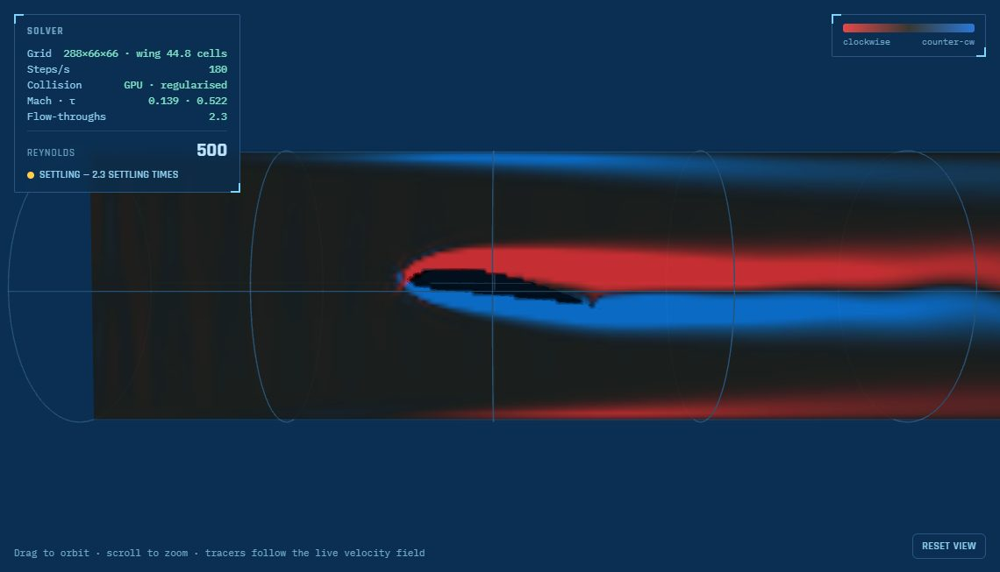

# AI Projects

[](https://github.com/kathuman/claude-projects/actions/workflows/tube-flow-ci.yml)
[](https://github.com/kathuman/claude-projects/actions/workflows/cobot-lab-ci.yml)
[](https://github.com/kathuman/claude-projects/actions/workflows/warehouse-model-ci.yml)
[](https://github.com/kathuman/claude-projects/actions/workflows/balancebot-ci.yml)
[](https://github.com/kathuman/claude-projects/actions/workflows/phone-sensors-ci.yml)
[](LICENSE)

Simulation and decision tools for engineering and supply chains, built with [Claude](https://claude.com) by
[Daniel Sepulveda Estay](https://kathuman.github.io/estay-dynamics/about.html) — almost all run in the browser, and
the serious ones are tested against exact solutions, published data or an independent model.

**Browse them all → [kathuman.github.io/claude-projects](https://kathuman.github.io/claude-projects/)**

## Flagship tools

<table>
<tr>
<td width="50%" valign="top">
<a href="https://kathuman.github.io/claude-projects/tube-flow-sim/"></a>
<b><a href="https://kathuman.github.io/claude-projects/tube-flow-sim/">Tube Flow</a></b> — a 3D lattice-Boltzmann CFD lab on the GPU (WebGPU):
spheres, other shapes, STL imports and NACA wing sections, with drag, lift, Strouhal number, pressure
distributions, Reynolds and angle-of-attack sweeps. Validated against Hagen–Poiseuille, the Haberman–Sayre
wall-corrected Stokes drag and Johnson &amp; Patel's sphere wakes, with a grid-convergence study —
<a href="https://kathuman.github.io/claude-projects/tube-flow-sim/validation.html">validation report</a>.
</td>
<td width="50%" valign="top">
<a href="https://kathuman.github.io/claude-projects/cobot-lab/"></a>
<b><a href="https://kathuman.github.io/claude-projects/cobot-lab/">Cobot Lab</a></b> — Universal Robots e-Series arms from their published
parameters (or any URDF): analytic and numerical inverse kinematics, timed Move J / L / C, RRT-Connect planning
around obstacles, Rapier physics with real pick &amp; place, URScript export and a ROS bridge. 1,600+ test checks.
</td>
</tr>
<tr>
<td width="50%" valign="top">
<a href="https://kathuman.github.io/claude-projects/warehouse-model/web/"></a>
<b><a href="https://kathuman.github.io/claude-projects/warehouse-model/web/">Warehouse Model</a></b> — warehouse design from first principles: a
parametric FreeCAD model and an analytical model share one layout (a parity test proves it on 400 designs),
with fire-code checks, lift-truck cycle times, a discrete-event simulation, total cost of ownership, an
optimiser, and IFC / DXF / glTF export.
</td>
<td width="50%" valign="top">
<a href="https://kathuman.github.io/claude-projects/network-stress-test/web/"></a>
<b><a href="https://kathuman.github.io/claude-projects/network-stress-test/web/">Network Stress Test</a></b> — a supply-network resilience
sandbox: an editable network of hundreds of nodes, a min-cost-flow solver, N-1 contingency scans, Monte Carlo
stress tests, time-to-survive / time-to-recover, and adversarial worst-case search.
</td>
</tr>
</table>

Also here: Chess, Xiangqi, Go and Othello with computer opponents, a Rubik's cube solver, a two-wheeled balancing-robot
simulator, a live view of every phone sensor (streamable to a computer), live face morphing, real options for network design, and a library of supply-chain visualisations.

## Tests

| Project | What is checked | Runs |
|---|---|---|
| Tube Flow | 34 solver checks (exact solutions, Stokes drag, momentum balance, STL bodies, inflows, wings) and the 22-check validation suite incl. grid convergence; GPU = CPU on 32 checks | CI (CPU); GPU parity locally in a WebGPU browser |
| Cobot Lab | 1,634 checks: forward/inverse kinematics, motion profiles, path planner, URDF import | CI |
| Warehouse Model | 300 checks + 400 designs identical in the FreeCAD script and the web app | CI (FreeCAD-only checks locally) |
| balancebot-sim | dynamics derivation and energy conservation | CI |
| Sensor Deck | 52 checks: step and shake detection, compass, FFT, GPS distance, CSV, phone-to-computer message checks | CI |

If you use any of this, [CITATION.cff](CITATION.cff) has the citation.

## Adding a new project

Open [`projects.json`](projects.json) and add an entry to the array:

```json
{
  "title": "Project Name",
  "description": "One or two sentences on what it does.",
  "date": "2026-08-31",
  "tags": ["python", "cli"],
  "repoUrl": "https://github.com/kathuman/project-repo",
  "demoUrl": "https://kathuman.github.io/project-repo/"
}
```

Notes:
- `date` uses `YYYY-MM-DD` — the list is sorted newest first.
- `tags` populates the filter chips automatically; use whatever lowercase words make sense.
- `repoUrl` and `demoUrl` are both optional — set either to `null` (or omit it) if it doesn't apply yet. A card with neither shows a "not yet published" badge instead of dead links.

Commit and push — GitHub Pages redeploys automatically within a minute or two.

```bash
git add projects.json
git commit -m "Add <project name>"
git push
```

## Publishing

GitHub Pages serves the repo root of `main` at `https://kathuman.github.io/claude-projects/`; every push
redeploys it within a minute or two.

## Local preview

Any static file server works, e.g.:

```bash
python -m http.server 8000
```

then open `http://localhost:8000`.

## Structure

```
index.html        — page markup
assets/style.css  — styling (light + dark themes)
assets/app.js     — loads projects.json, search/filter/theme logic
projects.json     — the actual project data — edit this to add projects
```

## Sub-apps

Some projects are self-contained web apps that live in their own folder here and
are served straight from GitHub Pages:

```
network-stress-test/web/index.html — https://kathuman.github.io/claude-projects/network-stress-test/web/
scientific-calculator/index.html   — https://kathuman.github.io/claude-projects/scientific-calculator/
rubiks-cube/index.html             — https://kathuman.github.io/claude-projects/rubiks-cube/
supply-chain-viz/index.html        — https://kathuman.github.io/claude-projects/supply-chain-viz/
real-options/index.html            — https://kathuman.github.io/claude-projects/real-options/
othello/index.html                 — https://kathuman.github.io/claude-projects/othello/
go/index.html                      — https://kathuman.github.io/claude-projects/go/
chess/index.html                   — https://kathuman.github.io/claude-projects/chess/
xiangqi/index.html                 — https://kathuman.github.io/claude-projects/xiangqi/
cobot-lab/index.html               — https://kathuman.github.io/claude-projects/cobot-lab/
tube-flow-sim/index.html           — https://kathuman.github.io/claude-projects/tube-flow-sim/
warehouse-model/web/index.html     — https://kathuman.github.io/claude-projects/warehouse-model/web/
face-morph/index.html              — https://kathuman.github.io/claude-projects/face-morph/
balancebot-sim/index.html          — https://kathuman.github.io/claude-projects/balancebot-sim/
phone-sensors/index.html           — https://kathuman.github.io/claude-projects/phone-sensors/
```

`warehouse-model` and `network-stress-test` are multi-file projects (several JS modules
alongside the page, not just a single HTML file) — their entry points are `web/index.html`,
not the folder root. See each folder's own `README.md` for its architecture.

`balancebot-sim/` is structured the same way, and goes further — it's a small
real project (web app + Python/FreeCAD tooling + a test suite + CI), not just
a multi-file page — with its own [README](balancebot-sim/README.md). Its
`index.html` at the folder root is just a redirect into `web/index.html`,
kept so its demo URL matches the pattern above.

Sub-apps may vendor third-party code under `<folder>/vendor/` (kept in-repo so the
app has no runtime CDN dependency); the licence sits beside it.

To add one, drop a folder with an `index.html` at the repo root and point the
project's `demoUrl` at `https://kathuman.github.io/claude-projects/<folder>/`.

## Native apps

One project is a native Android app (Flutter) rather than a static page, so it
isn't servable from GitHub Pages — its `demoUrl` is `null` and `repoUrl` points
at the folder. Building it requires the Flutter SDK:

```
othello-android/      — flutter build apk --release  (from inside the folder)
```
